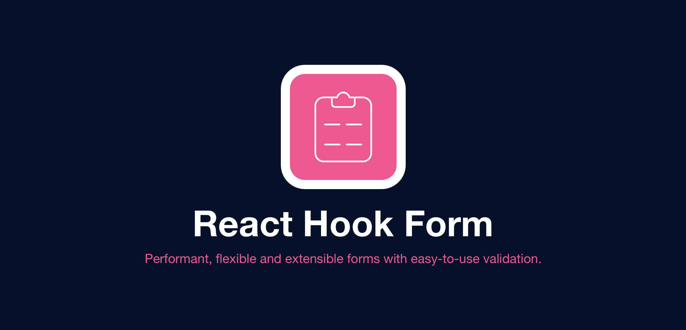

# React Hook Form

React-hook-form é uma biblioteca que ajuda a validar formulários no React, além disso é uma leb mínima sem quaisquer outras dependências. É eficiente e fácil de usar, exigindo que os desenvolvedores escrevam menos linhas de código do que outras bibliotecas de formulários.

## Introdução

O React Hook Form tem uma abordagem diferente de outras bibliotecas de formulários no ecossistema React. Ele adota o uso de entradas não controladas usando __ref__(referência) em vez de depender do estado para controlar as entradas. Essa abordagem torna os formulários mais eficientes e reduz o número de novas renderizações.

### Métodos utilizados no __React Hook Form__

> Principais métodos usados

- __register__ → Registra os campos com uma key para cada campo do formulário
- __setValue__ → Armazena o que está sendo digitado no campo de texto;
- __handleSubmit__ → É uma função que trata a submissão dos dados digitados nos campos de texto.

### Validações

Existem algumas formas de fazer validações dos dados, e uma das forma é utilizando o __yup__, que vai nos permitir criar um __schema__ de validações para garantir que os dados estejam corretos

> Para instalar _yup:__  **npm i -S yup**
